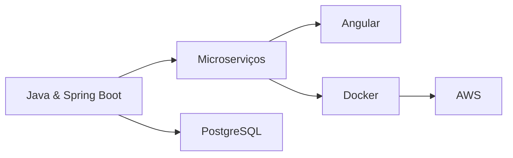

  
# 👋 Bem-vindo! Eu sou Rafael de Melo Santiago

### Engenheiro da Computação | Desenvolvedor Backend | Entusiasta Java

---

## 👨‍💻 Sobre Mim

Sou **graduado em Engenharia da Computação** pela Universidade Anhembi Morumbi (2025), apaixonado por construir soluções backend robustas e escaláveis. Atualmente focado em aprimorar minhas habilidades técnicas através de cursos online e desafios de programação, sempre buscando evoluir como desenvolvedor.

- 🎓 **Formação:** Engenharia da Computação - Anhembi Morumbi (2025)
- 🌍 **Localização:** São Paulo, Brasil
- 🗣️ **Idiomas:** Português (Nativo), Inglês (B2 - CEFR)
- 💼 **Foco Atual:** Desenvolvimento Backend com Java & Spring Boot
- 🎯 **Objetivo:** Construir arquiteturas de microserviços eficientes

---

## 🛠️ Stack Tecnológico

### Foco Atual

### Roadmap 2025

### Ferramentas & Outros

---

## 🚀 O Que Estou Fazendo Atualmente

- 📚 Fazendo cursos online pelo YouTube para aprimorar habilidades técnicas
- 💪 Resolvendo desafios de programação para melhorar capacidade de resolução de problemas
- 🔧 Construindo projetos com **Java** e **Spring Boot**
- 🌐 Explorando arquitetura de **Microserviços** e sistemas de **Mensageria**
- 📊 Trabalhando com **PostgreSQL** para gerenciamento robusto de dados

---

## 🎯 Caminho de Aprendizado 2025

✅ **Atual:** Java, Spring Boot, PostgreSQL, Microserviços, Mensageria  
⏳ **Próximo:** Angular, Docker, AWS

---

## 📊 Estatísticas do GitHub

  

---

## 💡 Áreas de Interesse

- ☕ **Desenvolvimento Backend** com Java & ecossistema Spring
- 🏗️ **Arquitetura de Microserviços** & Padrões de Projeto
- 📨 **Sistemas Orientados a Mensagens** (RabbitMQ, Kafka)
- 🗄️ **Design de Banco de Dados** & Otimização
- ☁️ **Computação em Nuvem** & práticas DevOps
- 🔒 **Segurança de APIs** & Melhores Práticas

---

## 📫 Vamos nos Conectar!

Estou sempre aberto para discutir novos projetos, ideias interessantes ou oportunidades de colaboração. Sinta-se à vontade para entrar em contato!

---

  
### ⭐ "O aprendizado contínuo é a chave para a melhoria contínua"

**Obrigado por visitar meu perfil!** 🚀

